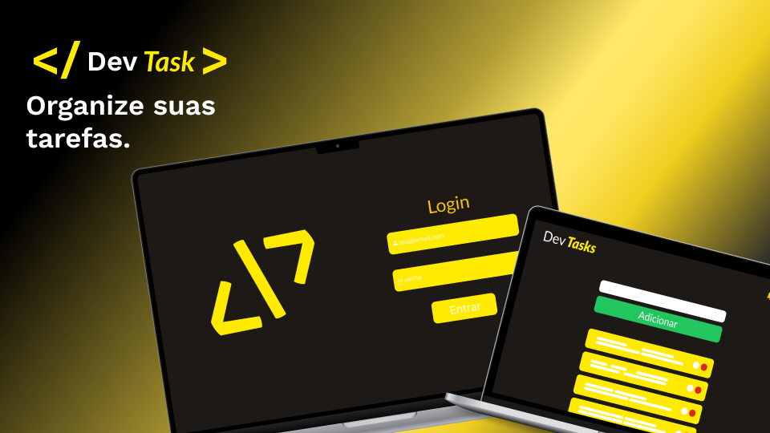

# DevTasks



Venha organizar e monitorar suas tarefas, tendo em mente seus
prazos :3

## 🚀 Começando

Essas instruções permitirão que você obtenha uma cópia do projeto em operação na sua máquina local para fins de desenvolvimento e teste.

## Framework e Bibliotecas utilizadas 🚀🚀
 ReactJs, Tailwindcss, TailwindScrollBar, clsx ,       React-Router-Dom, Axios, React-icons,Radix-ui.

### 🔧 Instalação

Uma série de exemplos passo-a-passo que informam o que você deve executar para ter um ambiente de desenvolvimento em execução.

Diga como essa etapa será:
```
git clone https://github.com/G4br1elM4t0s/devtask.git

cd devtask

npm i

npm run dev

Só ser feliz agora🚀  
```

## 🛠️ Construído com


* [ReactJs](https://pt-br.reactjs.org/) - O framework web usado.
* [Tailwindcss](https://tailwindcss.com/) - Gerir css de forma rapida e criativa.
* [React-icons](https://react-icons.github.io/react-icons/) - Usada para gerar os icons da aplicação.
* [React-Router-Dom](https://reactrouter.com/en/main) - Usada para gerenciar as rotas.
* [TailwindScrollBar](https://www.npmjs.com/package/tailwind-scrollbar) - Scroll personalizadas com o tailwind.
* [clsx](https://www.npmjs.com/package/clsx) - Usada para gerar condicionais para css.
* [Radix-ui](https://rometools.github.io/rome/) - Usada para gerar alguns components.
* [Axios](https://axios-http.com/ptbr/docs/api_intro) - Usada para fazer requisições.


